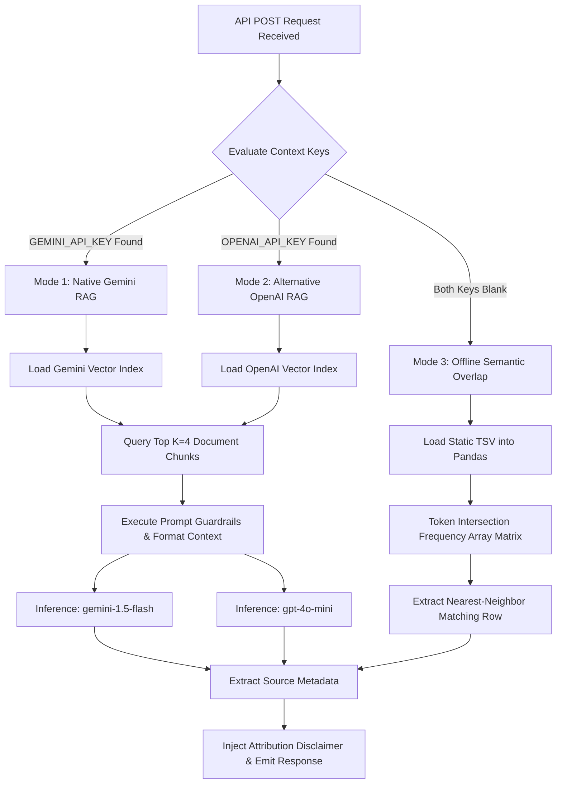

# 🧠 Vachan Study Bible Study Chatbot — Backend Architecture & RAG API Docs

Welcome to the backend engineering documentation for the **Vachan Study Bible Study Chatbot**. This document describes the design, data pipelines, Retrieval-Augmented Generation (RAG) infrastructure, and API configurations of our Python FastAPI backend.

## Current Architecture Alignment

The current backend is a FastAPI application centered around two core workflows: streaming RAG chat and voice transcription. The main request flow begins when the frontend sends a book code, user message, and recent chat history to the streaming chat endpoint. The backend detects the user language, generates an embedding for the query, runs hybrid retrieval over the available dataset, reranks the results, and decides whether to return a high-confidence dataset answer or continue through translation and AI-generation fallback paths. The response is streamed back to the frontend using Server-Sent Events. For voice input, the frontend captures audio blobs and POSTs them to the `/api/transcribe` endpoint, where the backend uses the native multimodal capabilities of Google Gemini (via the Gemini Key Rotator pool) to transcribe the audio into text safely across any browser.

## **Crucial Note:** This backend is explicitly optimized for **Vercel Serverless Functions**. Because Vercel utilizes a strictly read-only file system, all dynamic data acquisition (Git cloning, ZIP downloading) and FAISS vector compilation _must_ occur locally before deployment.

## 📁 Backend Directory Structure

To comply with serverless environments, the backend separates the local build tools from the static runtime assets.

```bash
backend/
├── api/                       # Vercel Serverless Function entry directory
│   └── index.py               # Live FastAPI server gateway & Tri-Mode RAG controller
├── static_data/               # Production assets (Enforced deployment bundle)
│   ├── vectorstores/          # Pre-compiled, book-specific FAISS indices (e.g., MAT, GEN)
│   └── bible_MAT.json         # High-speed static Scripture JSON for frontend viewing
├── scripts/                   # Local automation utilities
│   └── build_vector_db.py     # Local CLI compiler (Converts raw TSV data to FAISS)
├── data/                      # Local developer workspace (Excluded from Git)
│   └── en_tq/                 # Cloned unfoldingWord translation question TSV files
├── requirements.txt           # Declared package dependencies for Vercel deployment
├── vercel.json                # Vercel deployment and URL routing manifests
├── .env                       # Local environment secrets (Ignored by Git)
└── .env.example               # Explicit variable template for staging/production
```

---

## 📂 Data Architecture & Self-Healing Pre-Build Bootstrapping

To guarantee a frictionless "zero-setup" workspace for developers onboarding to the project, the local vector compiler (`scripts/build_vector_db.py`) employs two **Self-Healing Bootstrapping Data Mechanisms** during workspace initialization before any vectors are generated:

### 1. Local Workspace Prototyping (`bootstrap_data`)

If the compilation script is executed locally and cannot detect the baseline files `tq_MAT.csv` or `bible_MAT.json` in the working environment, it automatically generates localized mock data containing standard theological sample questions and Matthew 1 scripture[cite: 3]. This isolates development dependencies, allowing a developer to clone the repository and run local validation tests immediately without manual folder provisioning[cite: 3].

### 2. unfoldingWord TSV Dataset Acquisition (`clone_en_tq`)

The workspace is engineered to scale seamlessly across multi-book translation datasets. Before generating vector embeddings, the build script verifies if the raw unfoldingWord English Translation Questions (`en_tq`) directory is populated[cite: 3]. If the repository is missing, the workspace automatically self-heals using a dual-method acquisition strategy:

- **Method 1 (Git Shallow Clone):** The script executes a local system subprocess running `git clone --depth 1` against the Door43 gateway[cite: 3]. This minimizes download latency and local disk footprints by fetching only the latest commit snapshot[cite: 3].
- **Method 2 (HTTP ZIP Fallback Stream):** If the developer's machine lacks a global Git installation or faces network proxy restrictions, the script utilizes Python's native HTTP client to download the repository archive as a `.zip` stream, extracts it in memory, and maps the required TSV matrices directly into place[cite: 3].

---

## ⚙️ Core RAG Pipeline & Dual-Mode Retrieval

Our RAG system utilizes a **Dual-Mode Architecture** to handle high-fidelity LLM interactions and free, local testing:



### 1. The Vector Compiler (scripts/build_vector_db.py)

This local CLI utility serves as the data preprocessing engine of the application. It compiles raw translation datasets into highly optimized, book-specific FAISS vector indices. Running this script locally prior to deployment eliminates runtime database construction overhead, ensuring zero cloud initialization latency.

#### ⚙️ Ingestion Pipeline & Data Transformation

The compiler loads raw book data (e.g., `tq_GEN.tsv`, `tq_MAT.tsv`) into Pandas dataframes and strips out analytical noise to optimize embedding dimensions and minimize token usage.

To achieve high semantic retrieval accuracy, the schema divides incoming rows into two core segments:

- **Searchable Content Vector (Page Content):** The script merges the text targets into a single contextual paragraph, enabling the mathematical model to compute highly unified similarity vectors.
- **Immutable Metadata Bindings:** Structural details are injected directly into the vector array index nodes. This allows the API to extract citations and dynamic UI elements instantly from the nearest-neighbor matches without re-reading the source files.

| Source TSV Column                       | Extraction Type            | Operational Target Destination                                                                                    |
| :-------------------------------------- | :------------------------- | :---------------------------------------------------------------------------------------------------------------- |
| **`Question`**                          | Searchable Text + Metadata | Merged into the target context string; cached in metadata to populate frontend follow-up chips.                   |
| **`Response`**                          | Searchable Text Block      | Merged into the target context string to serve as the ground-truth text for LLM rephrasing.                       |
| **`Reference`**                         | Structural Metadata        | Kept as an unindexed token value (e.g., `"1:19"`) to trigger automated viewport highlights in the Scripture Pane. |
| **`ID`, `Tags`, `Quote`, `Occurrence`** | _Discarded_                | Completely omitted from compilation to minimize database file size and respect Vercel deployment constraints.     |

#### 🛠️ Processing Lifecycle Implementation

When executed via `python scripts/build_vector_db.py`, the script follows a strict processing sequence:

```text
[Read TSV Folder] ──> [Apply Schema Filter] ──> [Compute Multi-Book Embeddings] ──> [Serialize Local Binary]
```

### 2. Dynamic Retrieval & Multi-Model Layer (api/index.py)

This module serves as the runtime execution core of the serverless backend. It handles incoming HTTP POST requests, orchestrates the context extraction pipeline, acts as an environment-aware model routing gateway, and formats payloads for frontend ingestion.

#### 🔄 Runtime Routing & Execution Lifecycle

When a payload hits the `/api/chat` endpoint, the serverless function executes an automated five-stage lifecycle within memory:

```text
[Receive Payload] ──> [Path Resolution] ──> [Index Loading] ──> [LLM Inference] ──> [Metadata Harvesting]
```

### 3. Prompt Engineering & System Guardrails

To ensure absolute theological fidelity and prevent the LLM from generating "multi-hop" hallucinations using outside internet knowledge, the backend binds the cloud inference models within a highly restrictive context prompt.

The application utilizes LangChain's `PromptTemplate` to dynamically inject the retrieved FAISS chunks while enforcing strict operational parameters.

#### 🧠 The System Prompt Template

The core prompt architecture establishes a scholarly persona and guides the model to answer based on context, falling back gracefully to general AI knowledge when needed:

```python
prompt_tmpl = PromptTemplate(
    input_variables=["context", "question"],
    template="""You are the scholarly Bible Study Chatbot for "Vachan Study".
First, attempt to answer the question using ONLY the provided Context.
If the provided Context does not contain the answer, use your general AI knowledge to answer the question, but you MUST explicitly mention in your response that the answer comes from general knowledge rather than the specific study text.

Context:
{context}

Question: {question}

Answer naturally, and ALWAYS append this exact disclaimer at the very end on a new line:
"🤖 *This is an AI-generated response based on the unfoldingWord dataset.*"
"""
)
```

- **Disclaimer**: The server automatically appends the exact italicized disclaimer at the very end of every RAG response:
  `"🤖 This is an AI-generated response based on the unfoldingWord dataset."`

---

## 🌐 API Endpoint Specifications

The FastAPI application exposes two primary CORS-enabled REST endpoints. These routes are mapped globally via `vercel.json` and serve as the direct communication bridge between the React frontend and the RAG infrastructure.

### 1. Real-Time RAG Chat Gateway (`POST /api/chat`)

This is the core conversational endpoint. It processes natural language queries, executes the RAG pipeline, and extracts structural metadata (citations and UI chips) dynamically from the vector database.

- **Content-Type:** `application/json`
- **Request Body Schema:**

```json
{
  "book": "MAT",
  "message": "Why did Joseph want to divorce Mary?"
}
```

- **Internal Execution Logic:**
  1.  **Index Resolution:** Parses the `book` variable and loads the corresponding pre-compiled FAISS directory from `static_data/vectorstores/{book}`.
  2.  **Context Extraction:** Retrieves the top `4` nearest-neighbor chunks (`k=4`).
  3.  **Inference:** Sends Chunk 0 to the LLM (or Semantic Fallback) to generate the plain-text answer.
  4.  **Citation Mapping:** Extracts the primary scripture verse (e.g., `"1:19"`) from Chunk 0's metadata.
  5.  **Suggestion Generation:** Iterates through Chunks 1, 2, and 3, extracting the literal dataset `Question` strings to return as interactive UI chips.

- **Response JSON Schema:**

```json
{
  "answer": "In Matthew 1:19, Joseph resolved to divorce Mary quietly because he was a righteous man who wished to protect her from public disgrace.\n\n🤖 *This is an AI-generated response based on the unfoldingWord dataset.*",
  "reference": "1:19",
  "suggested_questions": [
    "What kind of man was Joseph?",
    "What happened to Joseph that made him decide to remain engaged?"
  ]
}
```

---

### 2. Zero-Latency Scripture Extraction (`GET /api/scripture/{book}/{chapter}`)

This endpoint instantly delivers full-text chapter and verse structures to populate the frontend's interactive reading viewport.

To bypass network latency and third-party API rate limits, this endpoint does not query external web servers. It executes a synchronous file read against the bundled deployment assets.

- **URL Parameter Structure:** `/api/scripture/MAT/1`
- **Internal Execution Logic:**
  1.  Reads the requested JSON block synchronously from `static_data/bible_{book}.json`.
  2.  Returns the exact chapter array instantly to guarantee sub-millisecond scrolling synchronization when the frontend user clicks a chat citation.

- **Response JSON Schema:**

```json
{
  "book": "Matthew",
  "chapter": 1,
  "verses": [
    {
      "verse": 1,
      "text": "The book of the genealogy of Jesus Christ, the son of David..."
    },
    {
      "verse": 2,
      "text": "Abraham was the father of Isaac, and Isaac the father of Jacob..."
    }
  ]
}
```

---

## ⚙️ Extending the Backend

Because this architecture strictly separates the local build pipeline from the cloud runtime to comply with serverless environments, extending the backend requires following the pre-build workflow.

### Adding New Books to the RAG Pipeline

To expand the study tool's capabilities to new books of the Bible, you must compile the data locally before pushing to the cloud:

1.  **Acquire Data:** Ensure the target unfoldingWord dataset (e.g., `tq_MRK.tsv`) is present in your local `data/en_tq/` workspace.
2.  **Compile Locally:** Execute the local compiler by running `python scripts/build_vector_db.py`. The script will automatically detect the new TSV file, query the embedding model, and serialize a new immutable FAISS index folder under `static_data/vectorstores/{BOOK_CODE}`.
3.  **Commit & Deploy:** Commit the newly generated static folder to your Git repository and push. Vercel will instantly detect and serve the new book with zero deployment latency.

### Local vs. Production Configurations

- **Local Development:** Managed via your local `.env` file and executed through Uvicorn. Use `uvicorn api.index:app --reload` to enable hot-reloading while modifying the FastAPI Python routes.
- **Vercel Production:** Vercel bypasses Uvicorn entirely and handles ASGI routing natively via the `vercel.json` manifest. You must inject your `GEMINI_API_KEY` (or OpenAI equivalent) directly into your Vercel Project Dashboard under **Settings > Environment Variables**. Do not commit your `.env` file to production.
