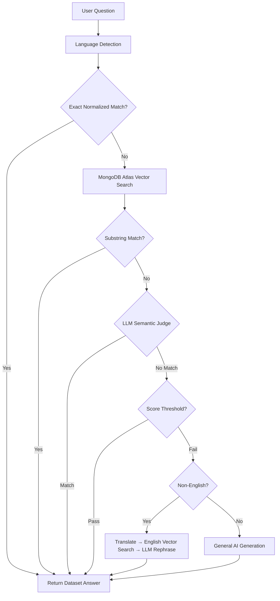
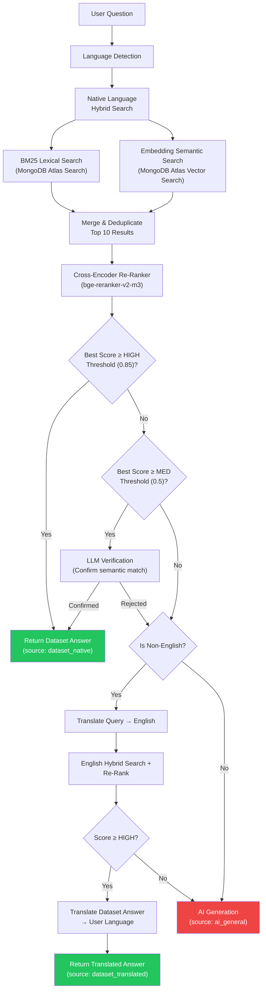
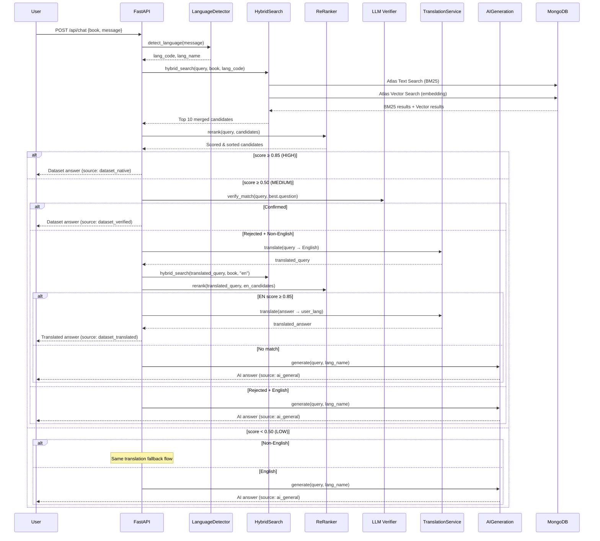

# Vachan Study RAG Pipeline — Complete Architecture Refactoring Plan

## 1. Architecture Review — Current State



### Current Stack

| Component | Technology |
|---|---|
| Embedding Model | `gemini-embedding-001` (768-dim) |
| Vector Store | MongoDB Atlas Vector Search (cosine) |
| Search Type | Semantic-only (no lexical/BM25) |
| Re-ranking | None |
| Matching | Normalized text → Substring → LLM Judge → Score threshold |
| Architecture | Monolithic 1340-line `index.py` |

---

## 2. Problems in Current Design

### Problem 1: Single-Mode Search (Semantic Only)
The system uses **only** embedding-based vector search. There is no lexical search (BM25). Bible references like "Genesis 1:1", proper names like "Joseph", and exact phrases are poorly captured by embeddings alone. BM25 excels at exact keyword and reference matching.

### Problem 2: No Re-ranking
The top-1 vector search result is trusted directly based on an arbitrary distance threshold (`< 0.35`). Without a **cross-encoder re-ranker**, the system cannot distinguish between "topically similar" and "semantically equivalent" results. This is the root cause of the active/passive voice failure.

### Problem 3: LLM-as-Judge is Expensive and Slow
The current Tier 1.5 `llm_semantic_match()` sends 5 candidates to Gemini/OpenAI on **every query** that misses exact match. This:
- Adds ~1-3s latency per query
- Costs ~200-400 tokens per call (doubles API usage)
- Is rate-limited to 15 RPM on Gemini free tier
A cross-encoder re-ranker achieves the same goal locally in ~50ms at zero API cost.

### Problem 4: Flat Document Schema
MongoDB documents store only `{question, response, reference, embedding}`. There are no paraphrases, no metadata (book name, chapter, verse), no language tag for filtering, and only a single embedding per question. Paraphrases would allow the vector search to catch rephrased queries naturally.

### Problem 5: No Text Search Index
MongoDB Atlas supports full-text search indexes (Atlas Search with BM25 scoring) alongside vector indexes. The current setup has **neither** — it only has the vector index named `"default"`.

### Problem 6: Embedding Model is Monolingual
`gemini-embedding-001` is primarily trained on English. Malayalam and other Indic language queries produce poor embedding quality. A multilingual embedding model would dramatically improve non-English retrieval.

### Problem 7: Translation Fallback Over-Relies on LLM
For non-English queries, the system translates to English, searches, then **asks an LLM to rephrase the answer** in the user's language (Step 2b). This produces AI-generated content even when a dataset answer exists. The system should translate the dataset answer directly.

### Problem 8: Monolithic File Architecture
All logic (1340 lines) is in a single `api/index.py`. Retrieval, re-ranking, translation, AI generation, rate limiting, scripture fetching, and history management are all interleaved. This makes testing, debugging, and extending nearly impossible.

### Problem 9: Score Threshold is Arbitrary and Provider-Dependent
`top_score < 0.35` for cosine distance is a magic number that doesn't generalize across embedding models. Different models produce different score distributions. A cross-encoder with calibrated thresholds is model-agnostic.

### Problem 10: No Paraphrase Enrichment
The dataset only stores the original question. There's no mechanism to generate and index variations (active/passive, synonym substitutions) that would improve recall at the embedding level.

### Problem 11: Retriever Cache is Unbounded
`retrievers: Dict[str, tuple] = {}` grows indefinitely in long-running processes (66 books × N languages = hundreds of cached retrievers).

### Problem 12: `get_retriever_for_book()` Blocks on Cold Start
Every new book/language combo triggers a synchronous MongoDB connection and LangChain wrapper construction inside the request handler.

---

## 3. Refactored Architecture



---

## 4. Embedding Model Comparison

| Model | Dimensions | Multilingual | Bible/Theological | Cost | Hosting |
|---|---|---|---|---|---|
| `gemini-embedding-001` | 768 | Limited | Medium | Free tier (1500/day) | API (Google) |
| `text-embedding-3-large` | 3072 | Good | Medium | $0.13/1M tokens | API (OpenAI) |
| `multilingual-e5-large` | 1024 | **Excellent** (100+ langs) | Medium | Free | Self-hosted |
| `BAAI/bge-m3` | 1024 | **Excellent** (100+ langs) | Medium | Free | Self-hosted |

### Recommendation: **`BAAI/bge-m3`**

**Why:**
- **Best multilingual performance** across 100+ languages including Malayalam, Tamil, Hindi
- Supports **dense + sparse (lexical) + ColBERT** retrieval in a single model — perfect for hybrid search
- 1024-dim embeddings (good balance of quality vs storage)
- **Free, self-hostable** — no API costs or rate limits
- Proven on MTEB benchmarks for cross-lingual retrieval
- Can generate both dense embeddings AND sparse BM25-compatible weights in one forward pass

**Trade-off:** Requires a GPU or high-memory CPU instance for serving. On Vercel Serverless, you'd use a dedicated embedding service (Railway, Render, or a small cloud VM).

> [!IMPORTANT]
> **Vercel Constraint:** Vercel Serverless Functions cannot load PyTorch models. BGE-M3 must run on a separate service. If this is a dealbreaker, keep `gemini-embedding-001` for now and add BM25 via MongoDB Atlas Search (text index) — this alone will fix most retrieval failures.

---

## 5. Cross-Encoder Re-Ranker Comparison

| Model | Parameters | Multilingual | Speed (CPU) | Quality |
|---|---|---|---|---|
| `BAAI/bge-reranker-v2-m3` | 568M | **Yes** (100+ langs) | ~80ms/10 docs | **Best** |
| `cross-encoder/ms-marco-MiniLM-L-12-v2` | 33M | English only | ~15ms/10 docs | Good |
| `BAAI/bge-reranker-large` | 560M | Limited | ~80ms/10 docs | Very Good |

### Recommendation: **`BAAI/bge-reranker-v2-m3`**

**Why:**
- **Multilingual** — handles Malayalam/English cross-language re-ranking natively
- State-of-the-art accuracy on MTEB re-ranking benchmarks
- Pairs naturally with BGE-M3 embeddings (same model family)
- Can run on CPU in ~80ms for 10 candidates (acceptable latency)

**Fallback option:** If you need to stay on Vercel Serverless (no self-hosted models), use the existing LLM Semantic Match as the re-ranker but only for the "medium confidence" zone — not every query.

> [!IMPORTANT]
> **Self-hosting requirement:** Like BGE-M3, this model requires a separate inference service. The plan below provides both paths: (A) self-hosted BGE models, (B) API-only with MongoDB Atlas Search BM25 + LLM verification.

---

## 6. Database Schema

### Collection: `qa_dataset`

```javascript
{
  "_id": ObjectId,
  "book_code": "MAT",                    // 3-letter Bible book code
  "lang_code": "en",                     // ISO 639-1 language code
  "reference": "1:19",                   // chapter:verse
  "chapter": 1,                          // Extracted for filtering
  "verse": 19,                           // Extracted for filtering
  
  "question": "Why did Joseph want to divorce Mary?",
  "response": "Joseph, being a just man...",
  
  "paraphrases": [                       // Auto-generated variations
    "Why was Mary going to be divorced by Joseph?",
    "What was Joseph's reason for wanting to end his engagement?",
    "For what reason did Joseph plan to quietly separate from Mary?"
  ],
  
  "search_text": "Why did Joseph want to divorce Mary? Why was Mary going to be divorced by Joseph? What was Joseph's reason for wanting to end his engagement?",
  
  "embedding": [0.012, -0.034, ...],     // Dense vector (1024-dim for bge-m3)
  
  "metadata": {
    "book_name": "Matthew",
    "testament": "NT",
    "source": "unfoldingWord_tq",
    "created_at": ISODate,
    "updated_at": ISODate
  }
}
```

### Collection: `chat_sessions` (Unchanged)

Same schema as current.

### Collection: `scripture_text` (Unchanged)

Same schema as current.

---

## 7. MongoDB Index Design

### Standard Indexes

```javascript
// qa_dataset
db.qa_dataset.createIndex({ "book_code": 1, "lang_code": 1 })
db.qa_dataset.createIndex({ "book_code": 1, "chapter": 1 })
db.qa_dataset.createIndex({ "lang_code": 1 })

// chat_sessions (unchanged)
db.chat_sessions.createIndex({ "session_id": 1 }, { unique: true })
db.chat_sessions.createIndex({ "user_id": 1 })

// scripture_text (unchanged)
db.scripture_text.createIndex({ "book": 1, "chapter": 1 })
```

### Atlas Search Index (BM25 — Lexical)

Create in MongoDB Atlas UI → Search Indexes → Create Index:

```json
{
  "name": "qa_text_search",
  "mappings": {
    "dynamic": false,
    "fields": {
      "search_text": {
        "type": "string",
        "analyzer": "luceneStandard",
        "searchAnalyzer": "luceneStandard"
      },
      "question": {
        "type": "string",
        "analyzer": "luceneStandard"
      },
      "book_code": {
        "type": "stringFacet"
      },
      "lang_code": {
        "type": "stringFacet"
      },
      "reference": {
        "type": "string",
        "analyzer": "luceneKeyword"
      }
    }
  }
}
```

### Atlas Vector Search Index

```json
{
  "name": "qa_vector_index",
  "type": "vectorSearch",
  "fields": [
    {
      "type": "vector",
      "path": "embedding",
      "numDimensions": 1024,
      "similarity": "cosine"
    },
    {
      "type": "filter",
      "path": "book_code"
    },
    {
      "type": "filter",
      "path": "lang_code"
    }
  ]
}
```

---

## 8. Retrieval Pipeline — Detailed

### Phase 1: Hybrid Search

```python
async def hybrid_search(query: str, book_code: str, lang_code: str, k: int = 10):
    # 1. BM25 Lexical Search via Atlas Search
    bm25_results = await atlas_text_search(query, book_code, lang_code, k=k)
    
    # 2. Embedding Semantic Search via Atlas Vector Search
    query_embedding = await embed_query(query)
    vector_results = await atlas_vector_search(query_embedding, book_code, lang_code, k=k)
    
    # 3. Merge + Deduplicate by _id
    merged = deduplicate(bm25_results + vector_results)
    
    return merged[:k]
```

### Phase 2: Cross-Encoder Re-Ranking

```python
def rerank(query: str, candidates: list[dict], threshold: float = 0.85):
    pairs = [(query, c["question"]) for c in candidates]
    
    # Score all pairs in a single batch
    scores = cross_encoder.predict(pairs)
    
    # Attach scores and sort
    for i, c in enumerate(candidates):
        c["rerank_score"] = float(scores[i])
    
    candidates.sort(key=lambda x: x["rerank_score"], reverse=True)
    return candidates
```

### Phase 3: Confidence Decision

```python
def decide(candidates, query, lang_code, lang_name):
    if not candidates:
        return None, "no_results"
    
    best = candidates[0]
    score = best["rerank_score"]
    
    # HIGH confidence — return directly
    if score >= 0.85:
        return best, "dataset_native"
    
    # MEDIUM confidence — LLM verification (only for this zone)
    if score >= 0.50:
        if llm_verify_match(query, best["question"]):
            return best, "dataset_verified"
        # Fall through
    
    # LOW confidence — no dataset match
    return None, "no_match"
```

---

## 9. Threshold Strategy

| Zone | Score Range | Action | Rationale |
|---|---|---|---|
| **HIGH** | `≥ 0.85` | Return dataset answer directly | Cross-encoder is highly confident. No LLM call needed. |
| **MEDIUM** | `0.50 – 0.84` | LLM verification (single call) | Ambiguous zone. LLM confirms/rejects. Saves tokens vs calling LLM on every query. |
| **LOW** | `< 0.50` | Skip dataset, go to translation/AI | Cross-encoder says this is not a match. Don't waste an LLM call. |

This replaces the current system's approach of calling `llm_semantic_match()` on every non-exact query. The LLM is only invoked for ~15-20% of queries (the medium zone), saving 80%+ of API costs.

---

## 10. Paraphrase Generation Pipeline

### Script: `scripts/generate_paraphrases.py`

For each question in the dataset, use Gemini to generate 3-5 paraphrases:

```python
PARAPHRASE_PROMPT = """Generate exactly 4 paraphrases of this question.
Include: active voice, passive voice, synonym replacement, and a casual rephrasing.
Output ONLY a JSON array of strings. No explanation.

Question: {question}"""
```

**Storage strategy:** Paraphrases are stored in the `paraphrases` array field on each document. The `search_text` field is a concatenation of the original question + all paraphrases, indexed by Atlas Search for BM25.

**Indexing strategy:** The embedding is computed on the original question (for semantic search). The paraphrases expand the BM25 lexical coverage.

**Query strategy:** BM25 searches `search_text` (catches paraphrases lexically). Vector search matches against `embedding` (catches semantic similarity). Both feed into the re-ranker.

---

## 11. Refactored Folder Structure

```
backend/
├── api/
│   └── index.py                    # FastAPI app, routes only (thin controller)
├── services/
│   ├── __init__.py
│   ├── retrieval.py                # HybridSearchService (BM25 + Vector + Merge)
│   ├── reranker.py                 # CrossEncoderReranker (bge-reranker-v2-m3)
│   ├── translation.py              # TranslationService (detect + translate)
│   ├── ai_generation.py            # AIGenerationService (Gemini/OpenAI fallback)
│   ├── embedding.py                # EmbeddingService (bge-m3 or Gemini)
│   └── rate_limiter.py             # TokenTracker + RateLimiter
├── db/
│   ├── mongodb.py                  # Connection manager (unchanged)
│   └── repositories.py            # DatasetRepository, HistoryRepository
├── schemas/
│   ├── __init__.py
│   ├── requests.py                 # ChatRequest, etc.
│   └── responses.py                # ChatResponse, etc.
├── scripts/
│   ├── build_vector_db.py          # (legacy, kept for FAISS compat)
│   ├── migrate_to_qa_dataset.py    # Migrates vector_embeddings → qa_dataset
│   ├── generate_paraphrases.py     # Generates paraphrases for all questions
│   └── setup_mongodb.py           # Updated with new indexes
├── config.py                       # All env vars, constants, thresholds
├── requirements.txt
└── vercel.json
```

---

## 12. New Pipeline Sequence Diagram



---

## 13. FastAPI Implementation Plan

### Phase 1: Schema & Config Extraction (No behavior change)
1. Create `config.py` — extract all env vars, constants, thresholds
2. Create `schemas/requests.py` and `schemas/responses.py` — move Pydantic models
3. Create `db/repositories.py` — extract MongoDB CRUD operations

### Phase 2: Service Layer (No behavior change)
4. Create `services/translation.py` — extract `detect_user_language()` and translation logic
5. Create `services/rate_limiter.py` — extract token tracking and rate limiting
6. Create `services/ai_generation.py` — extract general AI fallback logic
7. Refactor `api/index.py` to import from services (same behavior, clean code)

### Phase 3: Hybrid Search (Behavior change — improved retrieval)
8. Create `services/embedding.py` — embedding generation service
9. Create `services/retrieval.py` — `HybridSearchService` with BM25 + Vector
10. Create `services/reranker.py` — Cross-encoder re-ranking
11. Run `scripts/migrate_to_qa_dataset.py` — populate new `qa_dataset` collection
12. Run `scripts/generate_paraphrases.py` — enrich dataset with paraphrases
13. Create Atlas Search index (`qa_text_search`) and Vector index (`qa_vector_index`)
14. Replace the chat endpoint's retrieval logic with the new pipeline

---

## 14. Production & Cost Optimization

### Cost Breakdown (Current vs Proposed)

| Metric | Current | Proposed (API-only) | Proposed (Self-hosted) |
|---|---|---|---|
| LLM calls per query | 1-3 (semantic match + translate + generate) | 0-1 (only medium zone + AI fallback) | 0-1 |
| Embedding API calls | 1 per query | 1 per query | 0 (local) |
| Re-ranker cost | N/A | N/A | 0 (local) |
| Avg latency | 2-5s | 1-3s | 0.5-1.5s |
| Dataset retrieval rate | ~40-60% | ~85-95% | ~85-95% |

### Deployment Options

**Option A: API-Only (Vercel Compatible)**
- Keep `gemini-embedding-001` for embeddings
- Add MongoDB Atlas Search (BM25) — free on Atlas
- Use LLM verification only for medium-confidence zone
- Remove `llm_semantic_match()` for high/low zones
- **Estimated improvement: 60% → 85% dataset retrieval rate**

**Option B: Self-Hosted (Maximum Quality)**
- Deploy BGE-M3 + BGE-Reranker on Railway/Render ($7-20/mo)
- Zero API costs for embedding and re-ranking
- **Estimated improvement: 60% → 95% dataset retrieval rate**

---

## Open Questions

> [!IMPORTANT]
> **Deployment constraint:** Can you run a small self-hosted inference service (e.g., Railway, Render, or a VPS)? This unlocks BGE-M3 + cross-encoder re-ranking at zero API cost. If not, we proceed with Option A (API-only: Atlas Search BM25 + Gemini embeddings + LLM verification for medium zone).

> [!IMPORTANT]
> **Migration strategy:** The current `vector_embeddings` collection has Gemini embeddings (768-dim). The new `qa_dataset` collection will need new embeddings (1024-dim for BGE-M3, or keep 768 for Gemini). Should we:
> - (A) Keep the old collection running during migration (zero downtime), or
> - (B) Do a clean cutover (brief downtime)?

> [!IMPORTANT]
> **Paraphrase generation:** Generating paraphrases for all 66 books (~10,000+ questions) will require ~2,500+ Gemini API calls. This should be a one-time batch job. Are you comfortable running this overnight?

## Verification Plan

### Automated Tests
- Create a test suite with 50 known question pairs (active/passive, synonym, Malayalam↔English)
- Measure dataset retrieval rate before and after (target: >85%)
- Measure average response latency before and after

### Manual Verification
- Test active/passive: "Why did Joseph want to divorce Mary?" vs "Why was Mary going to be divorced?"
- Test Malayalam → English fallback with dataset-grounded answers
- Test that non-matching queries still produce quality AI answers
- Verify `source` field correctly labels each response tier
